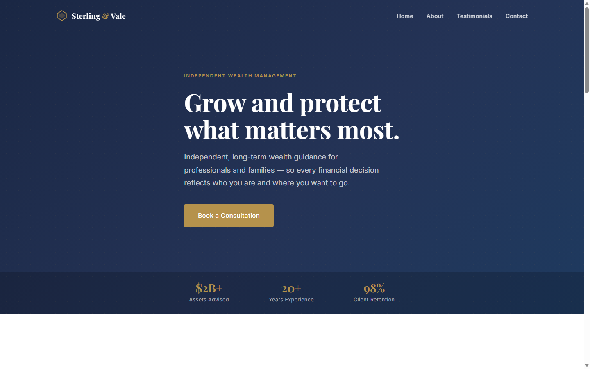

# Sterling & Vale Advisory

A static one-page wealth advisory website built with vanilla HTML, CSS, and JavaScript — no frameworks, no build tools.

**Live site:** https://lookupdvc-dot.github.io/caludetraining/



## Sections

| Section | Content |
|---|---|
| Hero | Headline, trust stats ($2B+ advised, 20+ years, 98% retention), CTA |
| Services | Wealth Planning, Retirement Strategy, Portfolio Management, Estate Planning |
| About | Firm story and fee-only fiduciary values |
| Testimonials | Auto-advancing carousel (3 client quotes, 5-second interval) |
| Contact | Enquiry form with client-side validation, submits via FormSubmit |

## Files

| File | Purpose |
|---|---|
| `index.html` | All markup |
| `styles.css` | All styles — colour tokens in `:root` at the top |
| `script.js` | Navbar, scroll animations, carousel, and form logic |
| `.github/workflows/deploy.yml` | GitHub Actions deploy pipeline |

## Running Locally

A local HTTP server is required (the form uses `fetch`, which is blocked on `file://`):

```bash
python -m http.server 3000
```

Then open http://localhost:3000

## Deployment

Deployed automatically to GitHub Pages via GitHub Actions on every push to `main`. The workflow (`deploy.yml`) uploads the entire repo root as the Pages artifact — no build step required.

Live URL: https://lookupdvc-dot.github.io/caludetraining/
